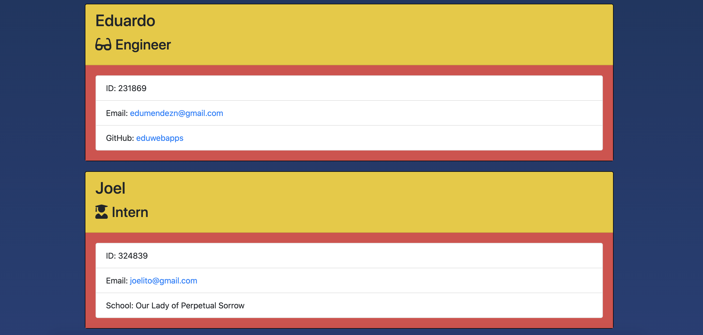

# Template Engine Employee Summary

## User Story

As a web developer, I want to be able to build a Node CLI that takes in information about employees and generates an HTML webpage that displays summaries for each person. 

## Table of Content

* [Description](#description)
* [Requirements](#requirements)
* [Screenshots](#screenshots)
* [Link to Application functionality](#link-to-application-functionality)
* [Tools](#tools)

## Description

Build a software engineering team generator command line application. The application will prompt the user for information about the team manager and then information about the team members. The user can input any number of team members, and they may be a mix of engineers and interns. This assignment must also pass all unit tests. When the user has completed building the team, the application will create an HTML file that displays a nicely formatted team roster based on the information provided by the user.

## Requirements 

* Use the [Inquirer npm package](https://github.com/SBoudrias/Inquirer.js/) to prompt the user for their email, id, and specific information based on their role with the company. 

* A manager should also enter office number, an intern should input their school name, and an engineer should provide their GitHub username.

* The app runs as a Node CLI to gather information about each employee.

## Screenshots

## Link to Application Functionality

<https://youtu.be/YvhFAQ1YJ_c>

## Tools

* Visual Studio Code <https://code.visualstudio.com>
* Dependencies: [jest]<https://jestjs.io/> for running the provided tests, and [inquirer]<https://www.npmjs.com/package/inquirer> for collecting input from the user.
* npm install
* npm run test
* Chrome DevTools - Inspect.
 